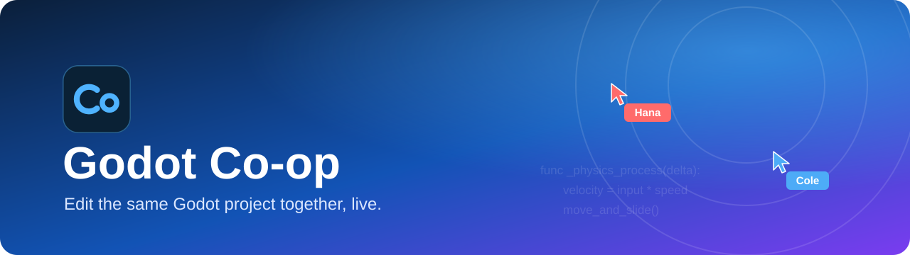
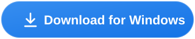
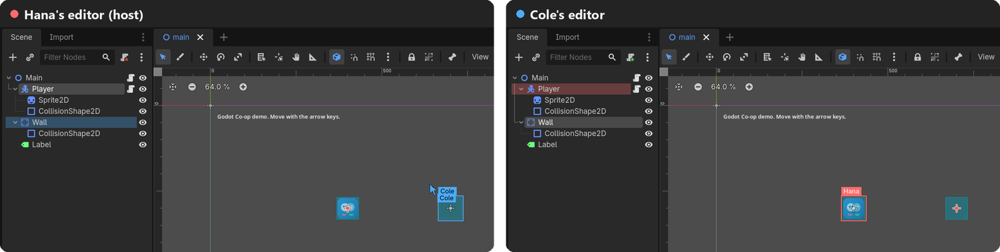
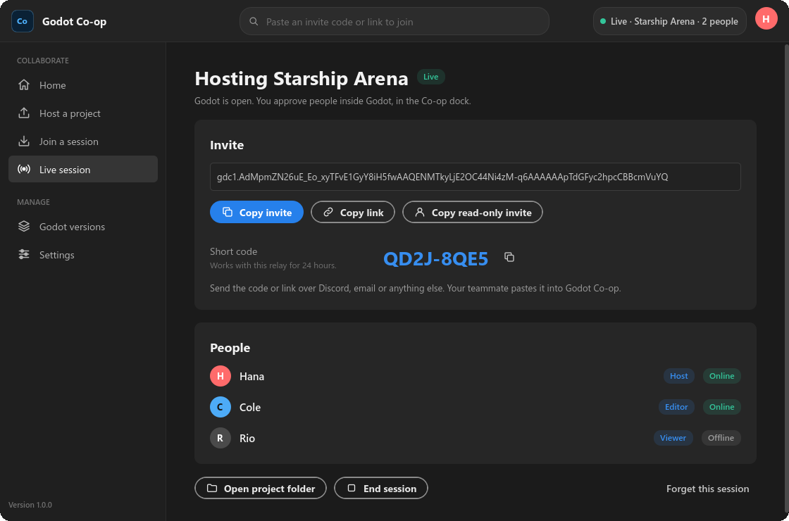
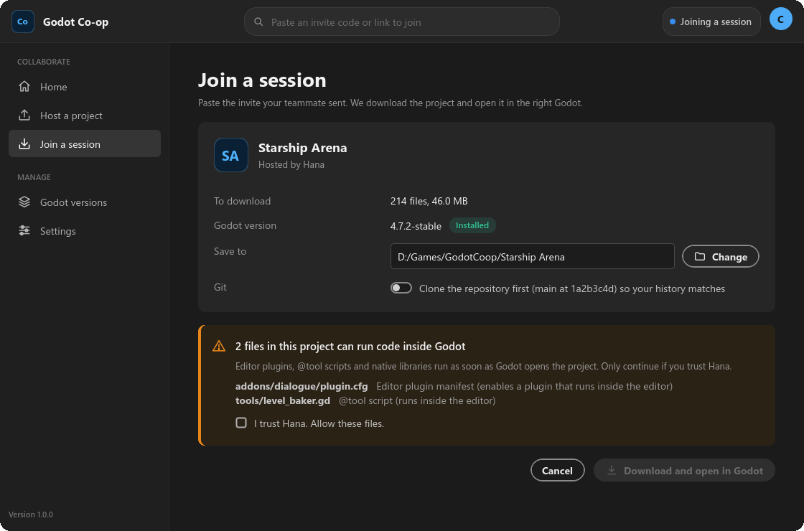
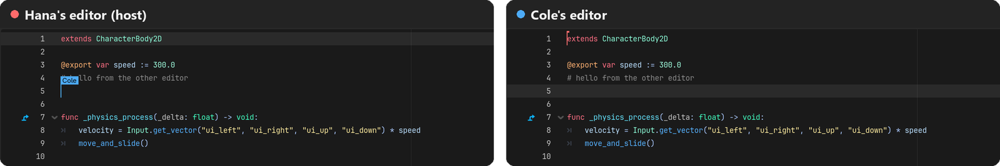
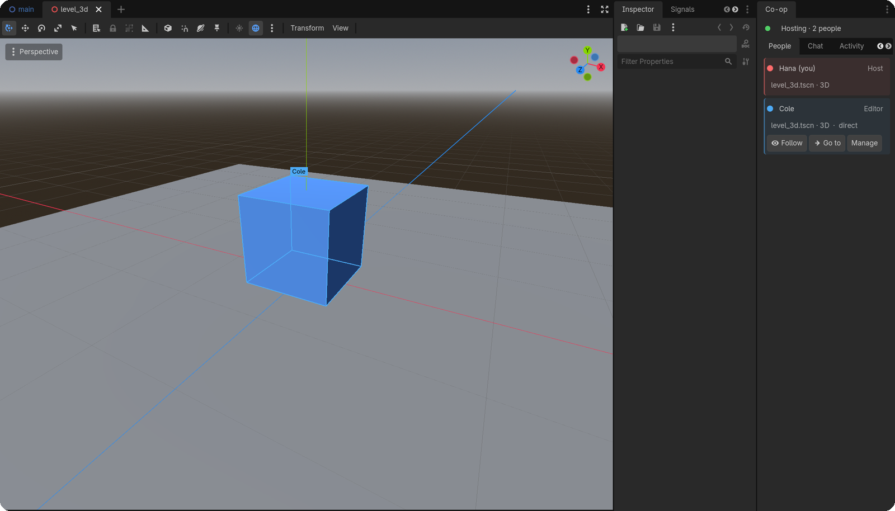
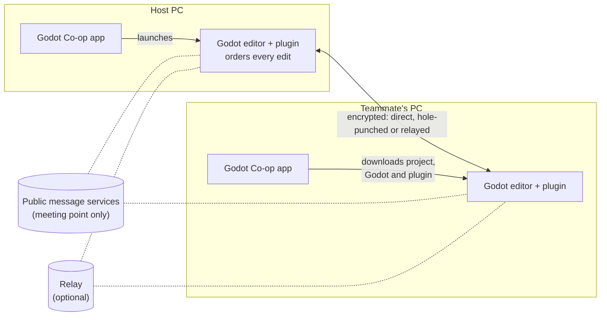

<p align="center">
  
</p>

<p align="center">
  <a href="https://github.com/i-Roboticist/godot-coop/releases/latest/download/GodotCoop-windows.zip"></a>
</p>

<p align="center">
  <a href="https://github.com/i-Roboticist/godot-coop/releases/latest"></a>
  <a href="https://github.com/i-Roboticist/godot-coop/releases"></a>
  
  <a href="https://github.com/i-Roboticist/godot-coop/actions/workflows/build.yml"></a>
  <a href="LICENSE"></a>
</p>

<p align="center">
  <b>Google Docs for your Godot project.</b> Several people work on the same project at the same time, each in their own editor.<br>
  Scene edits, script typing, new files and project settings show up for everyone, live. Free and open source, like Godot.
</p>

<p align="center">
  
  <br><sub>The same scene in two editors. Hana sees Cole's selection and cursor, and Cole sees Hana's.</sub>
</p>

---

## ✨ What you get

<table>
<tr>
<td width="33%" valign="top">

### 🎬 Live scenes
Add, move, rename and delete nodes, tweak properties, drag gizmos. Everyone sees it as it happens.

</td>
<td width="33%" valign="top">

### ⌨️ Shared scripts
Type in the same script at once, Google Docs style. See each other's carets. Ctrl+Z only undoes *your* changes.

</td>
<td width="33%" valign="top">

### 👀 See each other
Teammates' selections, cursors and 3D cameras show in your viewport. **Follow** someone to watch what they're doing.

</td>
</tr>
<tr>
<td valign="top">

### 🔗 One invite code
Host a project, send the code on Discord. Your teammate's app downloads the project *and* the right Godot version.

</td>
<td valign="top">

### ▶️ Playtest together
**Play for everyone** runs the game on every machine at once. Multiplayer games connect automatically.

</td>
<td valign="top">

### 🔒 Private and safe
Peer to peer and end-to-end encrypted. The host approves everyone, and files that can run code are held for review.

</td>
</tr>
</table>

## 🚀 Get started

1. **[Download Godot Co-op](https://github.com/i-Roboticist/godot-coop/releases/latest/download/GodotCoop-windows.zip)**, unzip it anywhere and run `GodotCoop.exe`. Nothing to install.
2. **Host:** click **Host a project**, pick your project folder and click **Start hosting**. Godot opens with a **Co-op** dock.
3. **Invite:** send the invite code (or the short code) to your teammate.
4. **Join:** your teammate pastes it into the search bar at the top of their app, then clicks **Download and open in Godot**.
5. You approve them in the Co-op dock (**editor** or **viewer**), and you're working together.

<table>
<tr>
<td width="50%"></td>
<td width="50%"></td>
</tr>
<tr>
<td align="center"><sub>Hosting: share the invite, see who's in.</sub></td>
<td align="center"><sub>Joining: see what you'll download before you do.</sub></td>
</tr>
</table>

> [!NOTE]
> **"Windows protected your PC"?** Click **More info**, then **Run anyway**. Windows shows this for new apps that aren't code-signed yet. Signed releases are on the way (see [Code signing policy](#-code-signing-policy)), and the source is all here if you'd rather build it yourself.

**No app?** The editor plugin works on its own too. Copy `addons/godot_coop` from [`godot_coop_plugin.zip`](https://github.com/i-Roboticist/godot-coop/releases/latest/download/godot_coop_plugin.zip) into your project, enable **Godot Co-op** under *Project → Project Settings → Plugins*, and use the Co-op dock to host or join.

## 🎥 See it in action

<p align="center">
  
  <br><sub>Cole types a comment; it appears in Hana's editor with his caret.</sub>
</p>

<p align="center">
  
  <br><sub>In 3D you see teammates' selections and cameras. The Co-op dock shows who's where and lets you follow them.</sub>
</p>

## 🧩 All the features

<details>
<summary><b>Connecting</b></summary>

- Invite codes (`gdc1.…`), `godotcoop://join/…` links, optional https links via `web/join/index.html`, and short codes like `QD2J-8QE5` when a relay is set.
- The host approves every new person and picks their role. People already admitted reconnect automatically.
- Connection paths, tried together:
  - LAN and VPN addresses (Tailscale, ZeroTier…),
  - **over the internet with no setup:** the two apps find each other through free public message services (three MQTT brokers and ntfy.sh, all at once), learn their public addresses from STUN servers (Google, Cloudflare, Twilio) and punch a direct connection through both routers. The same trick Tailscale uses, without accounts,
  - your public address with the router port opened automatically (UPnP), on either side,
  - and the optional **relay**, which forwards traffic when both routers are too strict to punch through.
- **End-to-end encryption.** Keys come from a secret in the invite (AES-256-CBC + HMAC-SHA256, replay-protected). A relay can't read or forge traffic.
- **Same Godot version enforced.** A different version is turned away with a message saying which one is needed; the app downloads it.
</details>

<details>
<summary><b>Live editing</b></summary>

- **Scenes:** add, delete, rename, reparent and reorder nodes; properties; sub-resources such as shapes and materials (edited in place); groups and signal connections. Gizmo drags stream live.
- **Scripts:** everyone types in the same file at once (operational transformation, as in Google Docs). Teammates' carets and selections show in their colour.
- **Per-user undo.** Ctrl+Z undoes only your own changes, in scenes and in scripts.
- **Files:** anything added, changed or deleted in the project folder syncs, including from outside Godot (VS Code, Aseprite…). New assets import automatically.
  - Big files stream in chunks with progress and are verified by SHA-256.
  - Conflicts: the host's copy wins, and yours is backed up to `.coop/conflicts/`.
  - Reconnects do a three-way merge.
- **Project settings** sync through Godot's API, so there's no restart and no overwritten `project.godot`.
- **Scene locks.** Lock a scene to edit it alone; everyone else watches live and can *Request control*.
</details>

<details>
<summary><b>Presence</b></summary>

- The People list shows who is where (`level.tscn · 3D`, `player.gd:42`) and how they're connected.
- Teammates' selections and 2D mouse cursors are drawn in your viewport. In 3D you see their selections and where their camera is.
- Teammates' selections are tinted in the Scene dock, and files they have open in the FileSystem dock.
- **Follow:** your view tracks a teammate's scene, 2D pan and zoom, 3D camera or script.
- **Ping:** right-click a node, a spot in the 2D view, a script line or a file, then **Ping for Everyone**. It flashes for everyone with a *Jump* button.
- **Activity feed** (click an entry to jump there), e.g. "Cole changed Player.speed 200 → 250". Plus team **chat**.
</details>

<details>
<summary><b>Playtesting together</b></summary>

- **Play for everyone** runs the game on every machine at once.
- For multiplayer games, the instances connect automatically: the host's game is the server, and everyone else's connects through an encrypted tunnel inside the session. It works through the relay too, with no port forwarding:
  ```gdscript
  const CoopPlaytest = preload("res://addons/godot_coop/runtime/coop_playtest.gd")

  func _ready():
      if CoopPlaytest.is_active():
          multiplayer.multiplayer_peer = CoopPlaytest.create_peer()  # server on host, client elsewhere
  ```
</details>

<details>
<summary><b>Roles and safety</b></summary>

- Roles: **host**, **editor**, **viewer** (read-only; edits are undone with a notice), or an editor **limited to folders** (e.g. `res://art`). The host can remove people.
- **Code-running files are held for review:** editor plugins, `@tool` scripts (including ones embedded in scenes), GDExtensions and executables. Accept or reject them in the dock's **Review** tab; joiners see the list before downloading. Autoload and plugin changes to project settings wait for approval too.
- Synced paths are validated (no `..`, no absolute paths, no Windows device names). `.godot/` and `.git/` are never synced. Add your own exclusions in `.coopignore` (gitignore-style).
</details>

<details>
<summary><b>Git</b></summary>

- When you join, the plugin compares commits with the host and warns if they differ.
- The app can **clone the host's repo** and check out the same commit before syncing.
- When the session ends, the host can **commit the session's changes with every contributor as a co-author**.
</details>

## ❓ FAQ

<details>
<summary><b>Do I need a server?</b></summary>

No. The host's PC is the server. On the same network it just works, and over the internet the apps connect directly too: they meet through free public message services, then punch a connection through both routers (no port forwarding, no accounts). Everything they exchange there is encrypted with the invite's secret.

That works for most home and office networks. If both of you are behind very strict networks (some campus, hotel or mobile networks), the join fails with a message saying so. Then either use a free VPN that puts you on one network, like [Tailscale](https://tailscale.com) or [Radmin VPN](https://www.radmin-vpn.com) (host again or click **New codes** after connecting so the invite includes the VPN address), or run the optional [relay](#relay-server-optional) on any machine with a public UDP port.
</details>

<details>
<summary><b>What happens if two people edit the same thing at once?</b></summary>

- **Same script:** both people's typing is kept. Edits are merged character by character, the way Google Docs does it, so nobody's keystrokes are lost and everyone ends up with identical text.
- **Same scene:** the host puts every change in order, so all editors end up identical. If two people set the same property at the same moment, the later change wins. Different nodes or different properties never conflict.
- **Same file outside a live editor:** the host's copy wins and yours is saved to `.coop/conflicts/`.
- Want to work alone on something? **Lock** the scene; others watch live until you hand it back.
</details>

<details>
<summary><b>Is my project uploaded anywhere?</b></summary>

No. Files go straight from the host's PC to your teammates', encrypted. Even when traffic goes through a relay, the relay can't read it. There's no account, no cloud and no telemetry.
</details>

<details>
<summary><b>Does everyone need the app?</b></summary>

It's the easy way, because it downloads the project and the matching Godot version for you. But the plugin alone is enough: anyone with the same Godot version and the plugin installed can host or join from the Co-op dock.
</details>

<details>
<summary><b>Mac and Linux?</b></summary>

The editor plugin is plain GDScript and works anywhere Godot does. The companion app is built for Windows today; the relay also runs on Linux (`python build.py --linux`).
</details>

<details>
<summary><b>Which Godot versions? C#?</b></summary>

Godot 4.4 or newer (built and tested on 4.7.2). Everyone in a session needs the same version, which the app enforces and downloads. C# scripts sync as files when saved rather than keystroke by keystroke, since they're usually edited in an external IDE anyway.
</details>

---

## Relay server (optional)

A relay makes connections work through any firewall and enables short codes. Run one on any machine with a public UDP port:

```bash
GodotCoop.console.exe --headless -- --relay --port 47600
```

Open **UDP 47600 and 47601** (47601 coordinates hole punching). Then put the relay's address in **Settings** (app) or **Connection settings** (dock). Only the **host** needs it; joiners get the relay from the invite. You can also tick **Run a relay server here** in the app's Settings.

## Invite web page (optional)

Host `web/join/index.html` anywhere static, e.g. GitHub Pages, and paste its URL into Settings. Invites then become clickable `https://…/join/#gdc1…` links. The code sits after `#`, so it's never sent to the web server. The page opens the app through `godotcoop://`; click **Register godotcoop:// links** in the app's Settings once (per Windows user, no admin rights needed).

## Limitations

- **Everyone needs the same Godot version.** This is enforced.
- **Nodes added inside an instanced sub-scene ("editable children")**, and overrides of nodes inside an instance, aren't live-synced. They reach teammates through the saved file when they reopen the scene. Editing the sub-scene itself is live, and "Make Local" is best done by one person at a time.
- **C# scripts, shaders, text resources and other files** sync when saved, not keystroke by keystroke. If two people save the same one at the same moment, the host's last save wins and the other version is kept in `.coop/conflicts/`.
- **Big values are sent whole.** Tile map data, polygons and animations sync as one value each, so two people painting the same TileMapLayer at the same moment can lose each other's strokes (the last one wins). Painting different layers, or taking turns, is fine.
- **A property a `@tool` script or an animation preview keeps changing** is only sent once it settles, so teammates see the end result rather than every frame.
- **If the host leaves, the session ends.** There's no host migration. Unsaved edits stay in each person's editor, so save before ending.
- **3D follow** moves your editor camera directly until you navigate yourself.
- **Testing so far:** the automated suites below, real sessions between two PCs on a LAN, and joins in both directions between a home network and a cloud data center (`.github/workflows/internet-test.yml` with `app/tests/inet_probe.gd`). Routers vary a lot, so reports from other networks are very welcome.
- **Joining over the internet needs a few public services.** The message services and STUN servers only help the two apps find each other; your project never goes through them. If they're all unreachable, LAN, VPN, UPnP and a relay still work.

---

## 🛠️ Building from source

Needs Python 3 and a Godot 4.7.x editor with export templates.

```bash
python build.py
```

This produces `dist/GodotCoop/GodotCoop.exe` (plus `GodotCoop.console.exe`, the web page and a relay launcher) and `dist/godot_coop_plugin.zip`. Set `GODOT=…` if your editor isn't found. Add `--test` to run all test suites first, `--linux` for a Linux build, `--sign` to code-sign with your own certificate (below).

Run the app from source with `Godot --path app`.

<details>
<summary><b>Signing your own builds</b></summary>

`python build.py --sign` signs `GodotCoop.exe` and `GodotCoop.console.exe` with `signtool` from the Windows SDK, then verifies them. Set one of these first:

| Certificate | Environment variables |
|---|---|
| Azure Artifact Signing (formerly Trusted Signing) | `SIGN_DLIB` = path to `Azure.CodeSigning.Dlib.dll`, `SIGN_METADATA` = path to a `metadata.json` holding your `Endpoint`, `CodeSigningAccountName` and `CertificateProfileName`. Sign in with `az login` first. |
| Certificate in the Windows store (USB token, cloud HSM, Certum, …) | `SIGN_CERT_SHA1` = the certificate's thumbprint |
| `.pfx` file | `SIGN_PFX`, plus `SIGN_PFX_PASSWORD` if it has one |

Optional: `SIGNTOOL` (path to signtool.exe if it isn't found), `SIGN_TIMESTAMP` (timestamp server URL). Signing doesn't disturb the app's embedded `.pck`, which Godot stores in its own section of the exe.
</details>

### Tests

Every push runs all of these on GitHub Actions.

| Suite | What it covers | Command |
|---|---|---|
| Unit | Text-merge fuzzing incl. 3-client convergence with undo, encryption (tamper/replay/reflection), invites, path safety, sync planner, scene model, value serialization, security scanner | `Godot --headless --path app -s res://tests/unit_tests.gd` |
| App | Plugin installer, `project.godot` editing, Godot version parsing/URLs/zip extraction | `… -s res://tests/app_tests.gd` |
| Network | Relay + host + joiners in one process: approval, direct and relay-only joins, downloads, live file sync, quarantine, roles, concurrent script edits, scene ops and locks, chat, auto-reconnect, version refusal, kick, end | `… -s res://tests/net_tests.gd` |
| Two editors | Two real headless Godot editors: every kind of scene edit, sub-resources, simultaneous typing, per-user undo, stale-buffer protection, file sync, settings, presence, locks, chat, follow, playtest tunnel, ending from the app | `python tests/editor/run_editor_tests.py` |
| Two editors, edge cases | Reopening a script mid-session, saving while edits are in flight, Godot's own Edit > Undo, new scripts, Change Type, two people adding the same node name, a script attached before its file arrives, built-in `@tool` scripts, properties changed every frame, opposite reparents, a teammate saving an instanced scene while you have unsaved edits | `python tests/editor/run_editor_tests.py --suite edge` |
| End-to-end, windowed | The app hosts → real editor; a second app joins from the invite (download, plugin install, launch) → screenshots of presence, carets, follow mode | `python tests/editor/run_visual_test.py` |

### How it works



- **Host-authoritative.** The host's files are the source of truth, and the host orders every live edit, so all copies converge. Its own editor is just "peer 1".
- **Scenes.** Every node in an open scene gets a stable id. Local edits are found by diffing the tree against the last synced state, then sent as small ops. Ops from others are applied directly to nodes, outside your undo history. Anything unexpected falls back to a full reconcile against the host's copy.
- **Scripts** use operational transformation (a port of [ot.js](https://github.com/Operational-Transformation/ot.js)). Remote edits go into the CodeEdit as minimal inserts and deletes, so your caret stays put.
- **Open files aren't written from sync.** If someone saves a scene or script you have open, the newer file is applied when you close it; your open copy is already live-synced. This avoids Godot's "file changed on disk" prompts.

| Path | Contents |
|---|---|
| `app/addons/godot_coop/core/` | Engine-agnostic core: networking, sessions, encryption, file sync, scene and text documents, OT |
| `app/addons/godot_coop/editor/` | Editor integration: scene/script/settings sync, presence, playtest, dock |
| `app/src/` | The companion app |
| `examples/demo_game/` | A small 2D + 3D project to try it on |
| `tests/` | The two-editor and end-to-end test harnesses |

## 🔏 Code signing policy

Windows releases are built from this repository by [GitHub Actions](.github/workflows/build.yml), and only those builds are signed.

- Free code signing provided by [SignPath.io](https://about.signpath.io), certificate by [SignPath Foundation](https://signpath.org) *(application in progress; signing starts once approved)*.
- Committers and reviewers: [i-Roboticist](https://github.com/i-Roboticist)
- Approvers: [i-Roboticist](https://github.com/i-Roboticist)

**Privacy:** Godot Co-op only connects to other computers when you ask it to: when you host or join a session (your teammates' PCs, a relay if you set one, and, so people on other networks can find each other, public STUN servers and message services: broker.hivemq.com, broker.emqx.io, test.mosquitto.org and ntfy.sh), download a Godot version (from GitHub), or clone a Git repository. What goes through the message services is a few small messages with network addresses, encrypted with the invite's secret. It has no telemetry, analytics or update checks.

## 🤝 Contributing

Bug reports, ideas and pull requests are all welcome. If something doesn't sync the way you expect, an [issue](https://github.com/i-Roboticist/godot-coop/issues) with the steps and the Godot version helps a lot. Run the test suites before opening a pull request; GitHub Actions runs them too.

## 📜 License

[MIT](LICENSE), like Godot. Godot Co-op is an independent project and isn't affiliated with or endorsed by the Godot Foundation.
